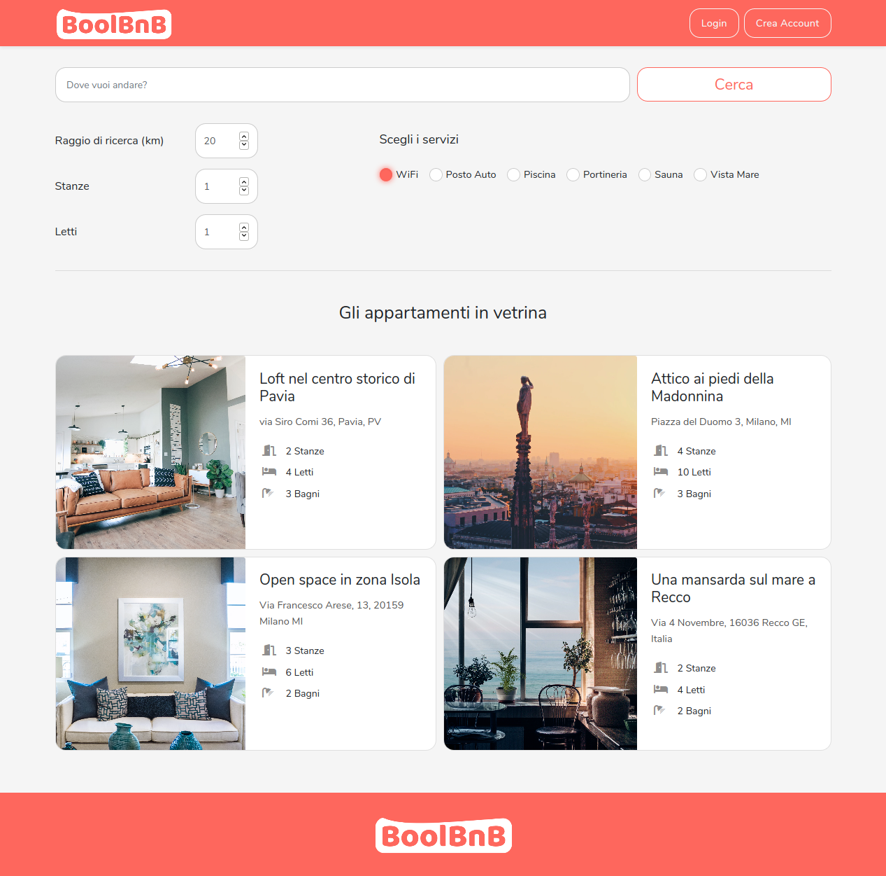
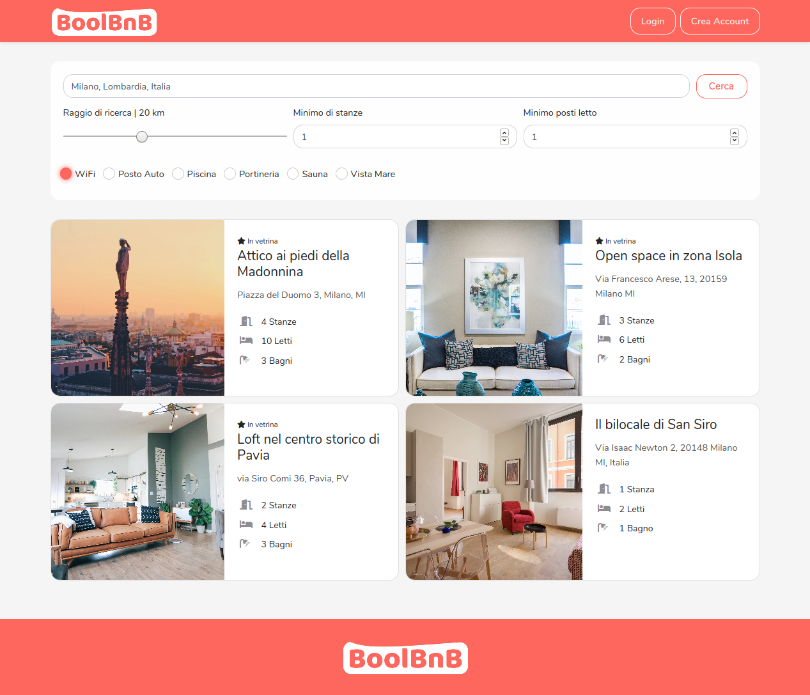
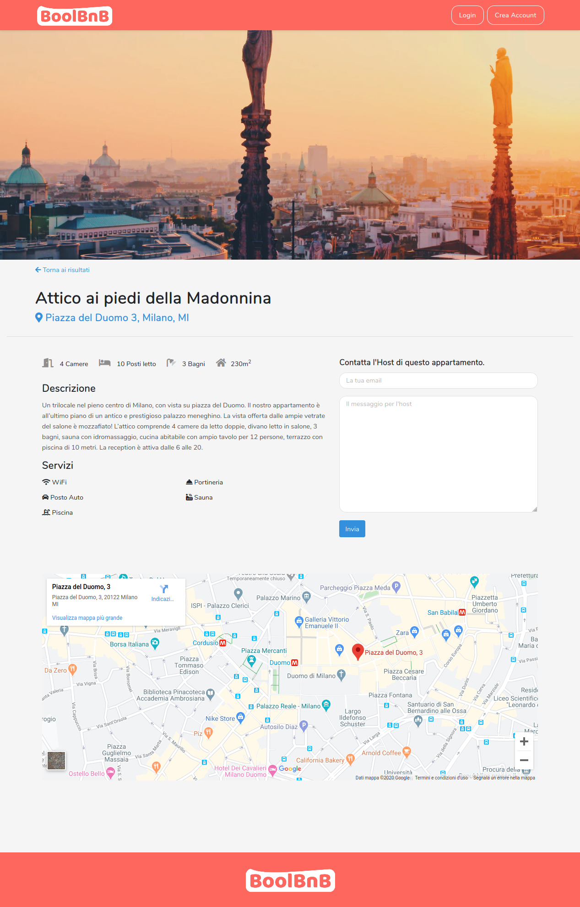
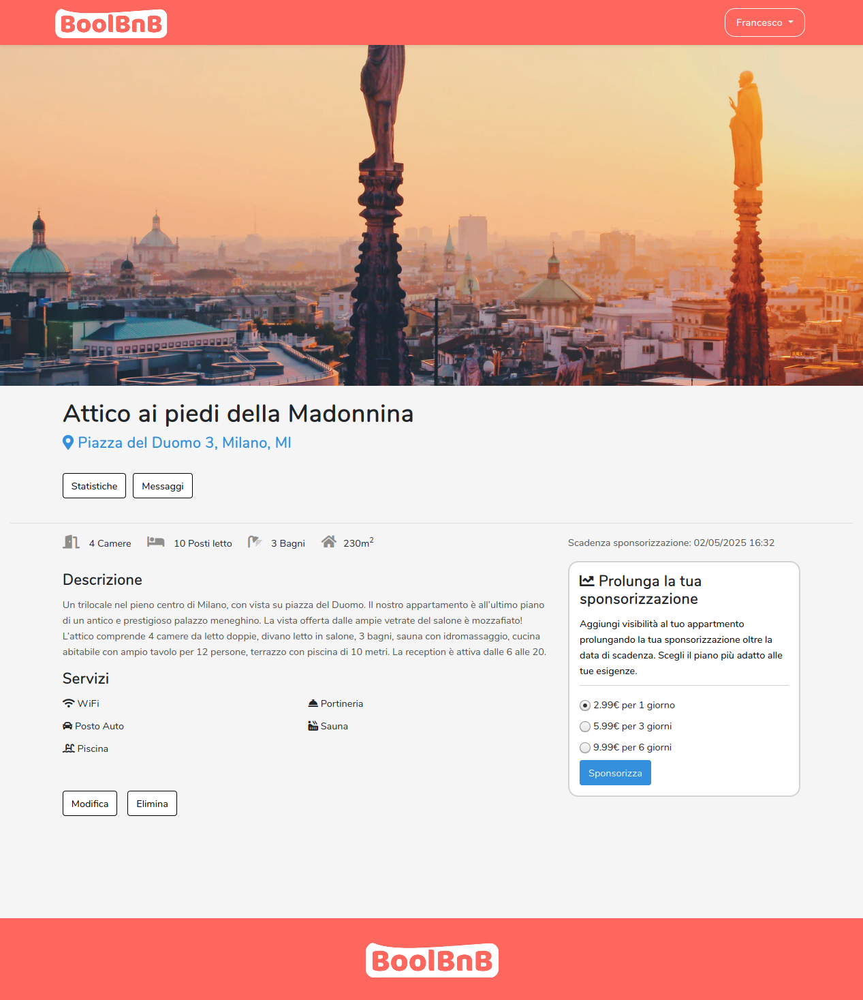

# BoolBnB
Sviluppo di una complessa Applicazione Web ispirata ad Airbnb.
- Lovoro in team.
- Laravel come back-end.
- MySql come database.
- Algolia Places per il geocoding.
- Braintree come gateway di pagamento.
- Per la funzione di ricerca abbiamo usato Scout Extended, Algolia e logica personalizzata con JavaScript e jQuery.
- Per il front-end HTML, SCSS e JS.
- Abbiamo implementato le  seguenti librerie esterne: Chart.js per le statistiche, Handlebars per il rendering dei risultati di ricerca.

Provala:
http://161.35.19.26/

